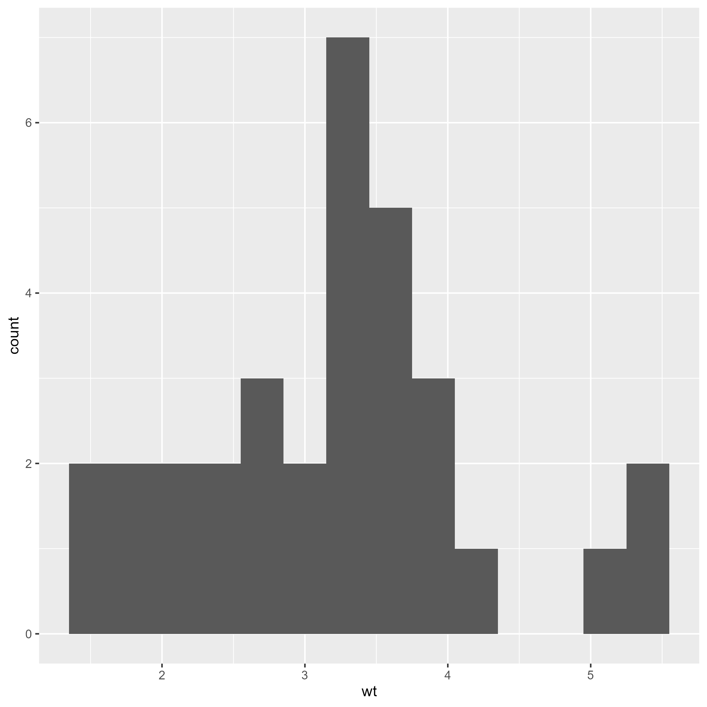

```{r}
#| eval: true
#| echo: false
setwd("W:/path/Intro-Quarto-UsingR")
```

```{r}
#| eval: false
setwd("Intro-Quarto-UsingR")
```

```{r}
library(knitr)
library(tidyverse)
library(janitor)
library(psych)
```

# Figure references

**Embed a png image**

```{r}
#| label: fig-1
#| fig-cap: "Histogram of weight"
#| out.width: "60%"
#| out.height: "30%"


```

\newpage 

# Simple markdown tables

@tbl-1 summarises the variables used in the analysis.

: Variables used {#tbl-1}

|     | Variables |
|-----|-----------|
| 1   | country   |
| 2   | urban     |
| 3   | age       |
| 4   | sex       |
| 5   | hlf       |


@tbl-2 controls the alignment of the second column.

: Variables used {#tbl-2}

|     | Variables |
|-----|:---------:|
| 1   | country   |
| 2   | urban     |
| 3   | age       |
| 4   | sex       |
| 5   | hlf       |


# Variables: Manual entry
@tbl-measures summarises the variables used in the analysis.

: Variables and measures {#tbl-measures}

|     | Variables | Description                    | Measures                     |
|-----|-----------|--------------------------------|------------------------------|
| 1   | country   | Country of residence           | 0=Non-UK, 1=UK               |
| 2   | urban_dv  | Urban or rural area            | 0=Rural, 1=Urban             |
| 3   | age       | Age                            | 16-65                        |
| 4   | sex       | Sex of respondent              | 0=Male, 1=Female             |
| 5   | hlf       | How feel about life as a whole | 0-10, 10 being most positive |


**One can also adjust the column widths in the table** as needed.

@tbl-measurescol summarises the variables used in the analysis.

: Variables and measures {#tbl-measurescol tbl-colwidths="[4, 12, 38, 46]"}

|     | Variables | Description                    | Measures                     |
|-----|-----------|--------------------------------|------------------------------|
| 1   | country   | Country of residence           | 0=Non-UK, 1=UK               |
| 2   | urban_dv  | Urban or rural area            | 0=Rural, 1=Urban             |
| 3   | age       | Age                            | 16-65                        |
| 4   | sex       | Sex of respondent              | 0=Male, 1=Female             |
| 5   | hlf       | How feel about life as a whole | 0-10, 10 being most positive |


## Exercise 1 {.unnumbered}

**Change the alignment of the table titled _“Variables and Measures”_ as needed.**

# Variables: Reading in a txt file 

```{r}
vardesc <- read_delim(
  "z_variables.txt",
  delim = "|"
)

# View(vardesc[2:6, 2:5])
```


```{r}
knitr::kable(vardesc[2:6, 2:5])
```


**One can adjust the column widths in the table using the R code chunk option below.**

```json
#| tbl-colwidths: [4, 12, 38, 46]
knitr::kable(vardesc[2:6, 2:5])
```

```{r}
#| echo: false
#| tbl-colwidths: [4, 12, 38, 46]
knitr::kable(vardesc[2:6, 2:5])
```


\newpage 

# Descriptive statistics

```{r}
#| echo: false
tab <- read_rds("z_mtcars_descstats.rds")
```

Have a look the table of descriptive statistics.

```{r}
#| echo: false
tab
```

## Basic
@tbl-desc displays descriptive statistics.
```{r}
#| label: tbl-desc
#| tbl-cap: "Descriptive statistics"

opts <- options(knitr.kable.NA = "") 
knitr::kable(tab) 
```

## Exercise 2 {.unnumbered}

Inspect these outputs and understand the formatting changes. Can you guess how to apply bold face?
```{r}
it <- data.frame(a = "Categorical variable",
                 i = "*Categorical variable*",
                 age = 30)
knitr::kable(it) 

it2 <- c("_Categorical variable_")
knitr::kable(it2) 
```

## Row formatting applied
Let us italicise the text in row 5.

@tbl-descit displays descriptive statistics.

```{r}
#| label: tbl-descit
#| tbl-cap: "Descriptive statistics"

tab[5, 1] <- c("*Categorical variable*")

opts <- options(knitr.kable.NA = "") 
knitr::kable(tab) 
```

## More complex formatting applied
What if one wishes to apply both bold face and italics in row 5? 
Examine @tbl-descitbold.

```{r}
#| label: tbl-descitbold
#| tbl-cap: "Descriptive statistics"

tab[5, 1] <- c("_**Categorical variable**_")

opts <- options(knitr.kable.NA = "") 
knitr::kable(tab, booktabs = T)
```


<!-- knitr::kable(tab, booktabs = T) -->

# Note
In YAML, one may try pygments, tango, arrow, zenburn, atom-one-dark for
`highlight-style:`.

One may also consider using the `kableExtra` package for additional features. In my personal experience, however, `knitr`  has resulted in fewer errors.

You may also find the *booktabs* option useful, as it may be needed in some instances for table formatting. In this example, however, we did not need to use this option.

```json
knitr::kable(tab, booktabs = T)
```


# Reference {.unnumbered}
<https://quarto.org/docs/authoring/tables.html>

<https://pkg.yihui.org/rmarkdown-cookbook/kable>

<https://stackoverflow.com/questions/28166168/how-to-change-fontface-bold-italics-for-a-cell-in-a-kable-table-in-rmarkdown>


